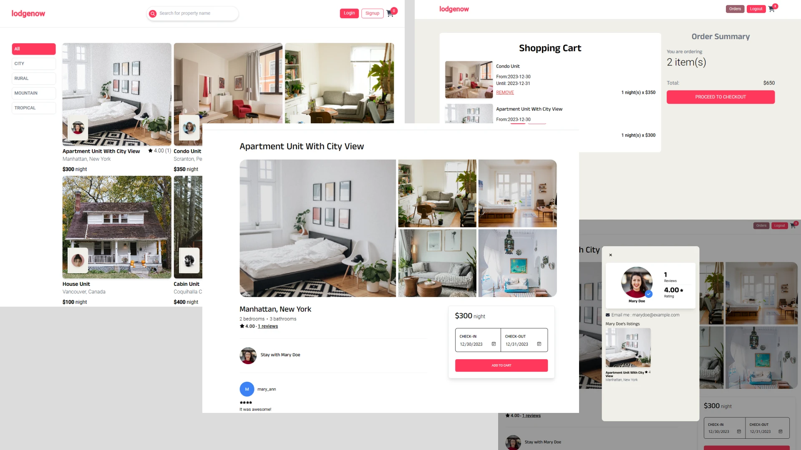
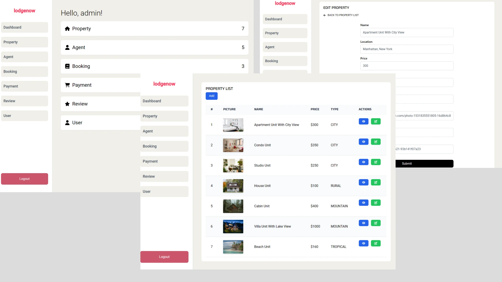

# lodgenow

"lodgenow" is a travel e-commerce app to demonstrate how to put "full-stack" development together that takes an inspiration from the popular travel e-commerce website, Airbnb. It contains the basic CRUD for property, shopping cart, and making bookings, except actual purchase.

## Tech Stack

**Backend:**

- Node.js / Express.js
- Postgres
- Prisma
- Typescript
- Jest & Supertest

**Frontend:**

- React
- Redux
- Vitejs
- Tailwind CSS
- Redux Toolkit Query
- Typescript

## Features

- Filter property by type
- Property reviews and agents
- Property pagination
- Property search by name
- Add booking to shopping cart
- Checkout the shopping cart
- Confirm / remove bookings
- View booking history
- Manage property in admin panel
- Manage agents in admin panel
- View user information in admin panel
- Database seeders
- Credential authentication & routes protection
- Linting and prettier commands

## Install with Docker

```bash
docker compose up
```

## Setup prisma

```bash
 docker compose run backend npx prisma db push
```

## Seed the database

```bash
 docker compose run backend npm run seed
```

```text
Sample User Logins

(Admin) /admin
username : admin
password : admin

(Client) /signin
username : mary_ann
password : Password_1

username : jerry_smith
password : Password_1
```

## Prisma studio (optional)

```bash
docker compose run -p 5555:5555 backend npx prisma studio
```

## Screenshots

### Client screnshot preview



### Admin screnshot preview


